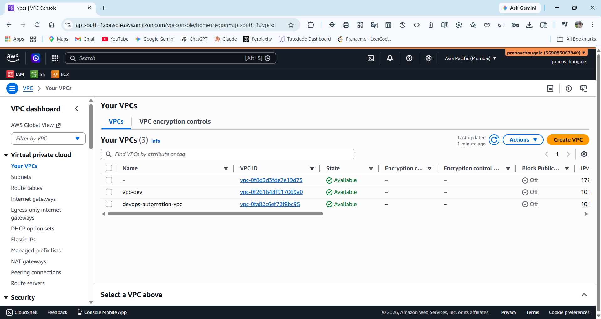

# CloudForge — End-to-End Infrastructure Automation & Deployment


A production-grade DevOps project demonstrating end-to-end infrastructure automation, configuration management, container orchestration, and CI/CD pipeline implementation on AWS.

---

## Architecture Overview

```
┌─────────────────────────────────────────────────────────┐
│                        AWS VPC                          │
│                                                         │
│  ┌──────────────┐         ┌─────────────────────────┐  │
│  │ Public Subnet│         │    Private Subnet        │  │
│  │              │         │                          │  │
│  │  ┌─────────┐ │   SSH   │  ┌────────┐  ┌───────┐  │  │
│  │  │ Bastion │─┼────────►│  │K8s     │  │K8s    │  │  │
│  │  │  Host   │ │         │  │Master  │  │Worker │  │  │
│  │  └─────────┘ │         │  └────────┘  └───────┘  │  │
│  │  ┌─────────┐ │         │             ┌───────┐   │  │
│  │  │   NAT   │ │         │             │K8s    │   │  │
│  │  │ Gateway │ │         │             │Worker │   │  │
│  │  └─────────┘ │         │             └───────┘   │  │
│  └──────────────┘         └─────────────────────────┘  │
└─────────────────────────────────────────────────────────┘
```

## Tech Stack

| Layer | Technology |
|---|---|
| Cloud Provider | AWS (ap-south-1) |
| Infrastructure as Code | Terraform |
| Configuration Management | Ansible |
| Container Orchestration | Kubernetes (kubeadm) |
| Container Runtime | containerd |
| CI/CD | GitHub Actions |
| Containerization | Docker |
| Image Registry | Docker Hub |
| App Runtime | Node.js + Express |

---

## Project Structure

```
CloudForge/
├── terraform/
│   ├── main.tf
│   ├── variables.tf
│   ├── outputs.tf
│   └── modules/
│       ├── vpc/          # VPC, subnets, IGW, NAT, routing
│       └── ec2/          # Bastion, K8s master, workers, SGs
├── ansible/
│   ├── inventory/
│   │   └── hosts.ini
│   ├── site.yml
│   ├── group_vars/
│   │   └── all.yml
│   └── roles/
│       ├── common/       # Base packages, kernel modules, sysctl
│       ├── containerd/   # Container runtime setup
│       ├── kubernetes/   # kubeadm, kubelet, kubectl
│       ├── k8s_master/   # Cluster init, CNI plugin
│       └── k8s_workers/  # Node join
├── kubernetes/
│   ├── namespace.yaml
│   ├── deployment.yaml
│   ├── service.yaml
│   ├── configmap.yaml
│   ├── hpa.yaml
│   └── pdb.yaml
├── app/
│   ├── src/
│   │   ├── index.js      # Express API
│   │   └── index.test.js # Jest tests
│   ├── Dockerfile
│   └── package.json
└── .github/
    └── workflows/
        ├── ci.yml        # CI pipeline
        └── cd.yml        # CD pipeline
```

---

## Infrastructure (Terraform)

Terraform provisions the following AWS resources:

- **VPC** with public and private subnets across 2 AZs
- **Internet Gateway** for public subnet routing
- **NAT Gateway** for private subnet outbound traffic
- **Bastion Host** (t3.micro) in public subnet for SSH access
- **Kubernetes Master** (t3.small) in private subnet
- **2 Kubernetes Workers** (t3.micro) in private subnet
- **Security Groups** with least-privilege rules

### Deploy Infrastructure
```bash
cd terraform
terraform init
terraform plan
terraform apply -auto-approve
```

---

## Configuration Management (Ansible)

Ansible configures all nodes with:

- System packages, kernel modules, sysctl params
- Swap disabled (Kubernetes requirement)
- containerd runtime with SystemdCgroup
- kubeadm, kubelet, kubectl (v1.28)
- Kubernetes cluster initialization (master)
- Worker node join

### Run Playbook
```bash
ansible-playbook -i ansible/inventory/hosts.ini ansible/site.yml
```

---

## Kubernetes Cluster

3-node cluster bootstrapped with kubeadm:

```
NAME             STATUS   ROLES           AGE    VERSION
master           Ready    control-plane   -      v1.28.0
ip-10-0-11-187   Ready    <none>          -      v1.28.0
ip-10-0-11-7     Ready    <none>          -      v1.28.0
```

### Verify Cluster
```bash
kubectl get nodes
kubectl get pods --all-namespaces
```

---

## Application

A RESTful Node.js/Express API with the following endpoints:

| Method | Endpoint | Description |
|---|---|---|
| GET | /health | Health check |
| GET | /api/items | List all items |
| POST | /api/items | Create item |
| GET | /metrics | Prometheus metrics |

---

## CI/CD Pipeline (GitHub Actions)

### CI Pipeline (`ci.yml`)
Triggered on every push:

1. **lint-and-test** — ESLint + Jest tests with coverage
2. **security-scan** — npm audit + Trivy filesystem scan + Checkov IaC scan
3. **docker-build-test** — Build Docker image + health check + Trivy image scan

### CD Pipeline (`cd.yml`)
Triggered on push to main:

1. **build-and-push** — Build and push Docker image to Docker Hub
2. **deploy-staging** — Apply Kubernetes manifests + rollout wait + smoke test
3. **deploy-production** — Deploy to production + Slack notification

---

## GitHub Secrets Required

| Secret | Description |
|---|---|
| `AWS_ACCESS_KEY_ID` | AWS access key |
| `AWS_SECRET_ACCESS_KEY` | AWS secret key |
| `DOCKERHUB_USERNAME` | Docker Hub username |
| `DOCKERHUB_TOKEN` | Docker Hub access token |
| `KUBECONFIG_B64` | Base64 encoded kubeconfig |
| `SLACK_WEBHOOK_URL` | Slack webhook for notifications |

---

## Screenshots

### Repository & CI/CD


### AWS Infrastructure





### Ansible & Kubernetes


---

## Results

- ✅ CI Pipeline fully passing (lint, test, security, docker)
- ✅ Docker image built and pushed to Docker Hub automatically
- ✅ Kubernetes cluster running with 3 nodes
- ✅ Application deployed and accessible via NodePort
- ⚠️ CD deploy-staging requires self-hosted runner (GitHub-hosted runners cannot reach private VPC)

---

## Key Learnings

- Terraform modular design for reusable infrastructure
- Ansible idempotent configuration management
- Kubernetes cluster bootstrapping with kubeadm
- GPG key handling for apt repositories
- SSH ProxyJump for bastion host tunneling
- GitHub Actions secrets management
- Docker multi-stage builds and security scanning

---

## Author

**Pranav Chougale**  
DevOps Engineer  
GitHub: [@Pranavmc](https://github.com/Pranavmc)
